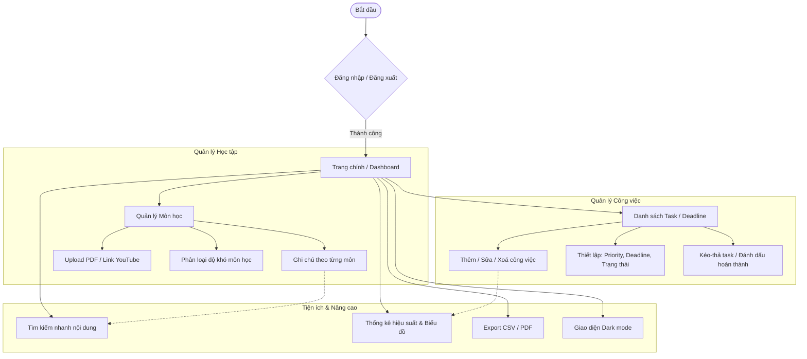

```mermaid
graph TD
    Start([Bắt đầu]) --> Login{Đăng nhập / Đăng xuất}
    
    Login -- Thành công --> Dashboard[Trang chính / Dashboard]
    
    subgraph "Quản lý Học tập"
        Dashboard --> Subjects[Quản lý Môn học]
        Subjects --> Notes[Ghi chú theo từng môn]
        Subjects --> Resources[Upload PDF / Link YouTube]
        Subjects --> Difficulty[Phân loại độ khó môn học]
    end

    subgraph "Quản lý Công việc"
        Dashboard --> Tasks[Danh sách Task / Deadline]
        Tasks --> TaskActions[Thêm / Sửa / Xoá công việc]
        Tasks --> TaskDetails[Thiết lập: Priority, Deadline, Trạng thái]
        Tasks --> Interaction[Kéo-thả task / Đánh dấu hoàn thành]
    end

    subgraph "Tiện ích & Nâng cao"
        Dashboard --> Search[Tìm kiếm nhanh nội dung]
        Dashboard --> Analytics[Thống kê hiệu suất & Biểu đồ]
        Dashboard --> Export[Export CSV / PDF]
        Dashboard --> Mode[Giao diện Dark mode]
    end

    TaskActions -.-> Analytics
    Notes -.-> Search
```